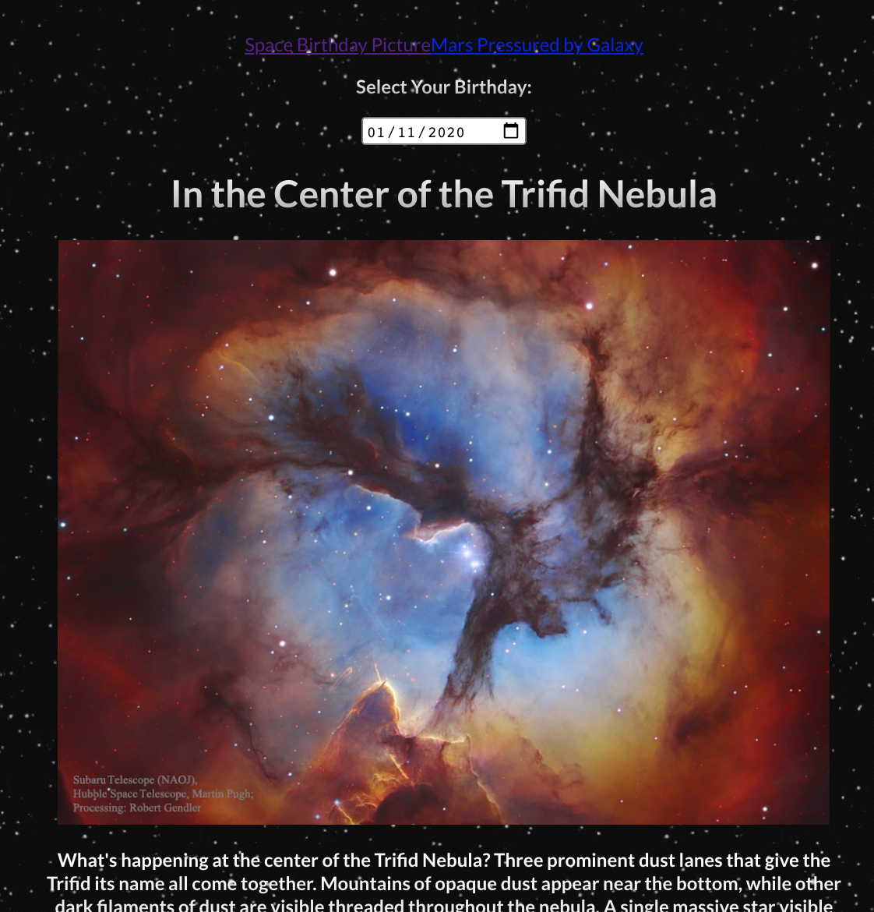

# Nasa-API

_6th November 2020_
_Week 7 [School of Code](https://www.schoolofcode.co.uk)_

During week 6 of School of Code we were tasked with using an API's to retrienve data and create an app.

This was our first time working in groups of 4, and my partners were Rebecca Jones @Beckster6211, Shanice Basra @spicy-rice & Alice Holden @aliceholden14

### We decided to use the Nasa API and for our MVP created an app that gets the Nasa image of the day based on a date after 1st July 1996

For our MLP we decided to try an learn a new technology and have a basic plot of Mars' temperature for different Solar Weeks - this needs a lot of work still, although we have a basic plot

## Built With:

- HTML
- CSS
- JavaScript
- React
- [Nasa API](https://api.nasa.gov)

## Installation

1. Clone the repository
   `https://github.com/randleem/Nasa-API.git`

2. Navigate to the repo

3. Install the node modules
   `npm i`

4. Sign up for a [Nasa API Key](https://api.nasa.gov) to add to your fetch request

5. Start the application
   `npm run start`
